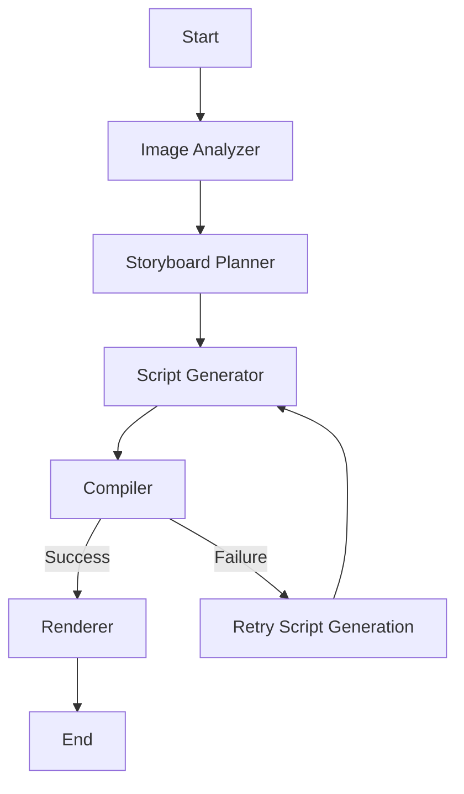

# AI Video Studio

AI Video Studio is a LangGraph-style agentic video generation prototype that turns images and a text prompt into a storyboard, generated script, compiler feedback loop, and a final video artifact. The project combines FastAPI, React, Remotion-compatible generation, Chroma-based retrieval, and a modular agent pipeline.

## Setup and Run Instructions

### 1. Python environment

```bash
python -m venv .venv
.\.venv\Scripts\activate
pip install -r requirements.txt
```

### 2. Frontend dependencies

```bash
npm install
```

### 3. Environment variables

Copy the sample file and update it with your values:

```bash
copy .env.example .env
```

Required variables:

- OPENAI_API_KEY: optional for OpenAI-compatible models
- OPENAI_MODEL: default model used for structured generation
- GROK_API_KEY: your xAI Grok API key for Grok-based generation
- GROK_MODEL: default Grok model (for example grok-2-latest)
- LLM_PROVIDER: set to grok to use xAI instead of OpenAI
- MAX_RETRIES: maximum compiler retry count
- OUTPUT_DIR: where rendered output is stored
- INPUT_DIR: where uploaded inputs are kept
- CHROMA_PERSIST_DIR: Chroma persistence directory

### 4. Run the backend

```bash
python main.py
```

The API will be available at:

- http://localhost:8000/health
- http://localhost:8000/generate
- http://localhost:8000/render
- http://localhost:8000/status

### 5. Run the frontend

```bash
npm run dev
```

The UI will be available at:

- http://localhost:5173

### 6. Run with Docker

```bash
docker compose up --build
```

## LangGraph Graph Diagram



## Model Selection Rationale

The current implementation is designed to be modular and model-agnostic, but the default flow uses the following approach:

- Image Analyzer: uses an OpenAI-compatible vision-capable model when an API key is present. This is the best fit for scene, object, people, emotion, and quality extraction because the node depends on deep visual understanding.
- Storyboard Planner: uses a language model to turn image analysis and prompt context into a structured timeline with scene ordering, camera movement, captions, transitions, and duration. A strong instruction-following model is ideal here.
- Script Generator: uses a language model suited for structured JSON and code-like output generation. This node benefits from a model that is reliable at formatting and following schema constraints.
- Compiler and Renderer: do not require a reasoning-heavy model. They are deterministic execution steps, so they are implemented as local runtime steps rather than model-dependent agents.

In practice, for the best balance of quality and cost, a lightweight reasoning or chat model such as GPT-4o-mini is a good default for analysis and generation, while heavier models can be reserved for more complex prompt interpretation.

## RAG Design Decisions

### Collections

The project uses a single Chroma collection named `video_styles` to store style and storytelling context.

### Source documents

The vector store is seeded from the following style files under the `styles/` directory:

- cinematic.txt
- birthday.txt
- corporate.txt
- travel.txt

### Chunking strategy

The current implementation uses full-file text content as document entries rather than small chunks. This is a simple and reliable first-pass approach for short style prompts, but it is not yet optimized for larger documentation corpora.

### Retrieval approach

Before script generation, the system retrieves top matching style context from Chroma using the user prompt. The retrieved context is injected into the script generation step so the output is guided by stylistic and narrative cues.

### Why this design

- It keeps setup simple and local-first.
- It works well for small, curated style files.
- It allows the system to adapt tone and pacing based on the prompt without hard-coding everything.

## Known Limitations

- The current implementation uses fallback logic when no API key is available, so it is fully runnable but not fully AI-driven without credentials.
- The compiler step is intentionally lightweight and uses a placeholder output path when a full Remotion render cannot be executed in the local environment.
- The RAG layer currently uses simple file-based documents and does not yet implement advanced chunking, metadata filters, or hybrid retrieval.
- The frontend is a minimal UI intended for demonstration and internship-style submission rather than a full production product experience.
- The project would benefit from stronger error handling, richer test coverage, and a true end-to-end Remotion rendering pipeline with audio and timeline synchronization if more time were available.

## Folder Structure

- agents/
- graph/
- models/
- rag/
- vectorstore/
- prompts/
- utils/
- api/
- frontend/
- remotion/
- tests/
- inputs/
- outputs/
- config/

## Screenshots

- Placeholder: add screenshots here.
